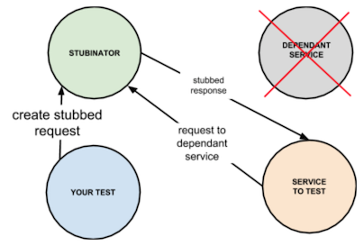

## What is Stibunator

**Stubinator** is a service to stub APIs of your dependant service during integration testing

It works really simple:

1. Submit a JSON to Stubinator describing your API to stub.
2. Stubinator stubs the API and starts responding with the given data.
3. Replace your dependant service with Stubinator.



Example of JSON to stub your API:

```json
{
  "method": "get",
  "path": "/test",
  "status": 200,
  "headers": {
    "Content-Type": "application/json"
  },
  "body": "{ \"key\": \"value\" }"
}
```

According to the above JSON, Stubinator will start responding with 200 OK and body `{ "key": "value" }` to every GET
request sent to the path '/test'.

You have to submit JSON to the Stubinator's path '/stub?name={stub_name}', where the 'name' parameter defines an
alias for your stub to reference it in future (e.g. to delete the stub).

To delete a stub just send DELETE request to /stub?name={stub_name}.

## How to run Stubinator

You can run from command line like this:

```bash
bundle exec passenger start
```

or you can run with Docker:

```bash
docker build -t stubinator .
docker run -it -d -p 3000:3000 stubinator
```

## How to test

Execute:

```bash
rspec ./spec/
```